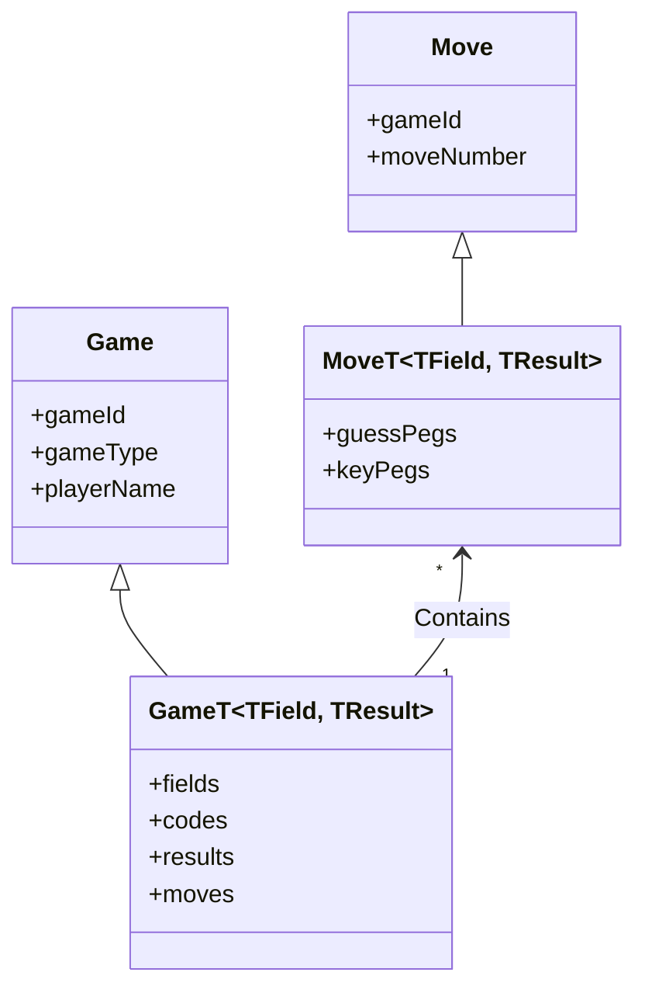

# Game Models

```mermaid
classDiagram
  direction TD
  Game <|-- GameT~TField, TResult~
  Move <|-- MoveT~TField, TResult~
  MoveT~TField, TResult~ "*" <-- "1" GameT~TField, TResult~ : Contains
  class Game{
    +gameId
    +gameType
    +playerName
  }
  class GameT~TField, TResult~{
    +fields
    +codes
    +results
    +moves
  }
  class Move{
    +gameId
    +moveNumber
  }
  class MoveT~TField, TResult~{
    +guessPegs
    +keyPegs
  }
```