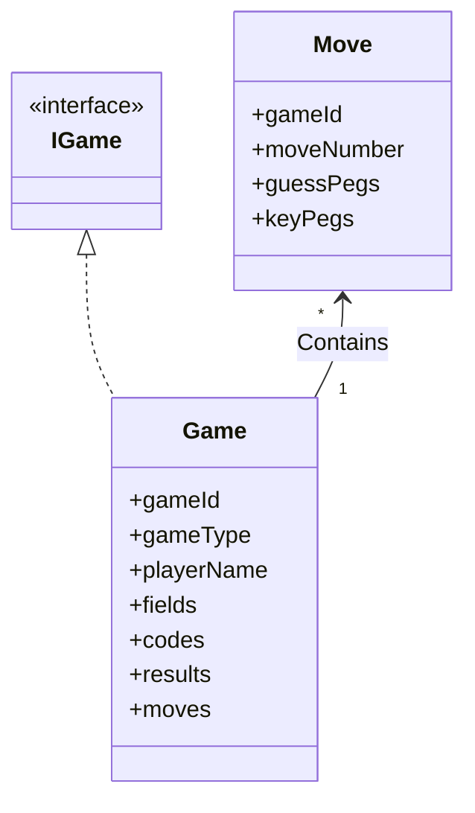

# Game Models

```mermaid
classDiagram
  direction TD
  IGame <|.. Game
  Move "*" <-- "1" Game : Contains
  class IGame {
    <<interface>>
  }
  class Game{
    +gameId
    +gameType
    +playerName
    +fields
    +codes
    +results
    +moves
  }

  class Move{
    +gameId
    +moveNumber
    +guessPegs
    +keyPegs
  }
```
