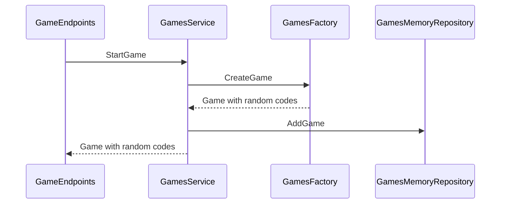

# Create a game

```mermaid
sequenceDiagram
    participant GameEndpoints
    participant GamesService
    participant GamesFactory
    participant GamesMemoryRepository
    GameEndpoints->>GamesService: StartGame
    GamesService->>GamesFactory: CreateGame
    GamesFactory-->>GamesService: Game with random codes
    GamesService->>GamesMemoryRepository: AddGame
    GamesService-->>GameEndpoints: Game with random codes
```