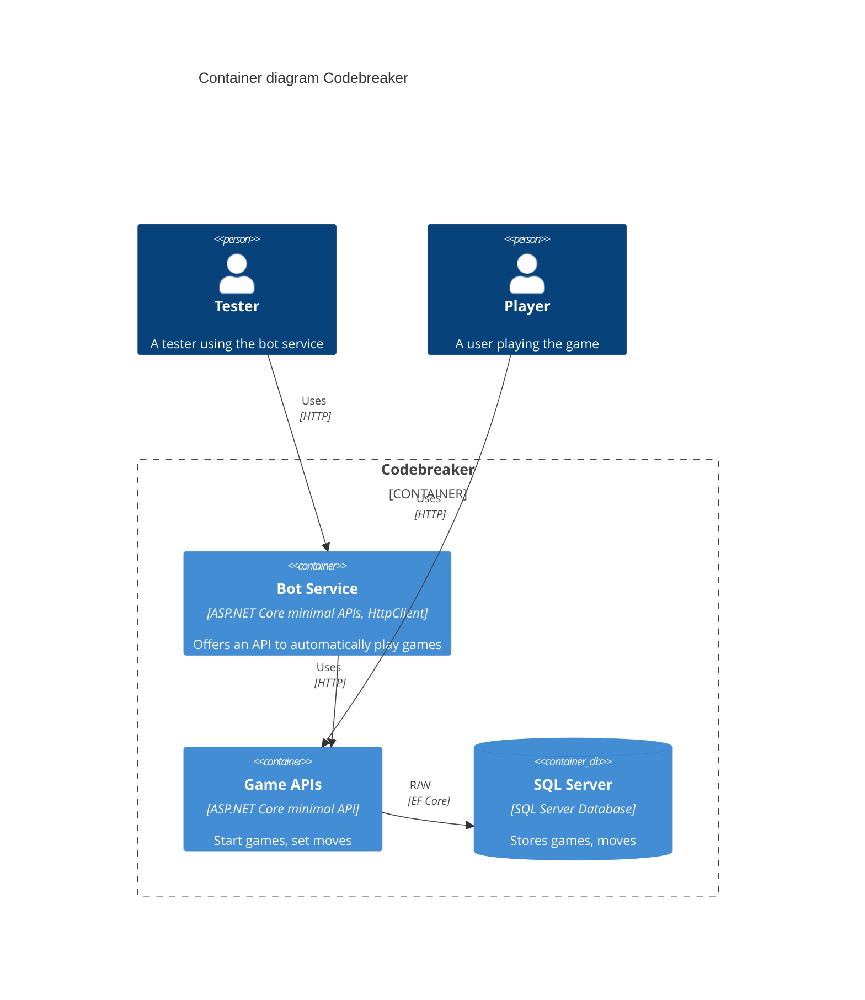
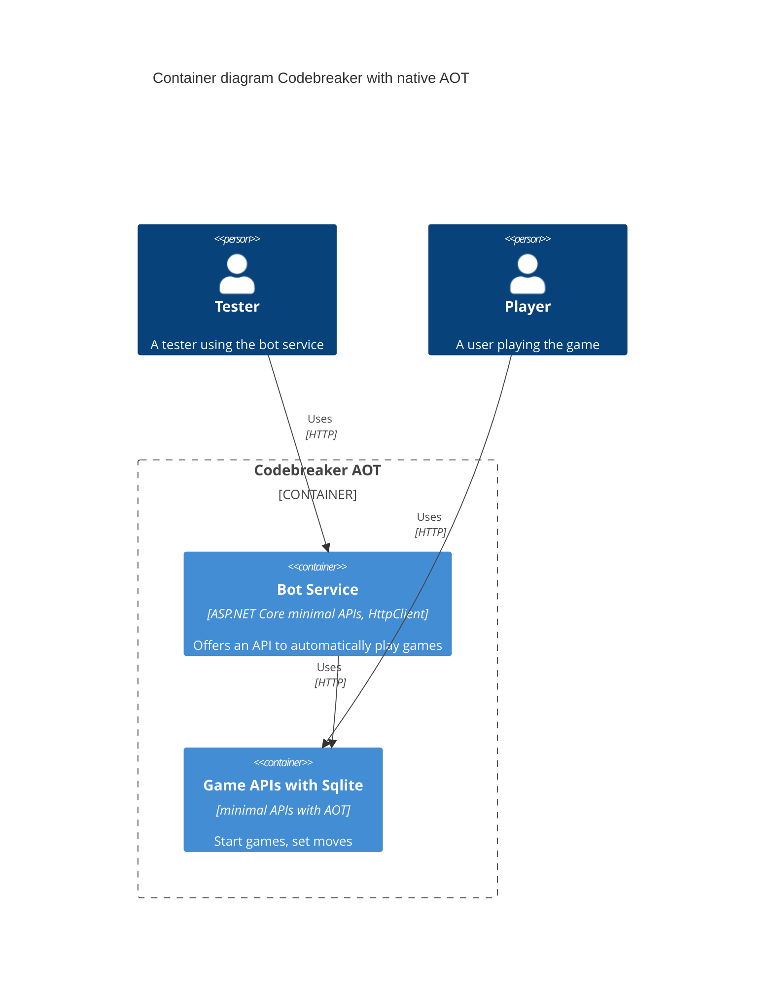

# Chapter 5

## Technical requirements

What you need to go through this chapter is **Docker Desktop**. *Docker Desktop is free for individual developers, education and open source communities. You can download Docker Desktop from [Docker Desktop](https://www.docker.com/products/docker-desktop/).

### Install WSL 2

To install the Windows Subsystem for Linux, read [How to install Linux on Windows with WSL](https://learn.microsoft.com/en-us/windows/wsl)

### Install Docker Desktop

To install Docker Desktop, read [Install Docker Desktop on Windows](https://docs.docker.com/docker-for-windows/install/)

### Source Code

The code for this chapter can be found in the following GitHub repository: https://github.com/PacktPublishing/Pragmatic-Microservices-With-CSharp-and-Azure
The source code folder ch05 contains the code samples for this chapter. Most projects are the same as from the previous Chapter, but two projects have been added: the bot service uses the minimal API to automatically play games. This service uses the client library you created in the previous chapter. 
ill build multiple Docker images with this chapter. This project makes use of the client library you created in the previous chapter. With this, you will create multiple Docker containers that interact with each other. Another project that has been added is the games API using native AOT.
In the ch05 folder you’ll see these projects:

* Codebreaker.GameAPIs.Models – the project with the models
* Codebreaker.Data.SqlServer – the EF Core context to access the SQL Server
* Codebreaker.Data.Cosmos – the EF Core context to access Azure Cosmos DB* Codebreaker.GameAPIs – the games API project we used in the previous chapter from our client application. In this chapter we make a minor update with the SQL Server connection string.
* Codebreaker.Bot - this is the new project that implements a REST API and calls the games API to automatically play games with random game moves. This project makes use of the client-library we created in Chapter 4 – it has a reference to the NuGet package CNinnovation.Coldebreaker.Client to call the games API.
* Codebreaker.GameAPIs.NativeAOT – a new project which offers the same games API with some changes to support native AOT with .NET 8

## Diagrams

### Docker Containers

### Docker Containers with Native AOT

