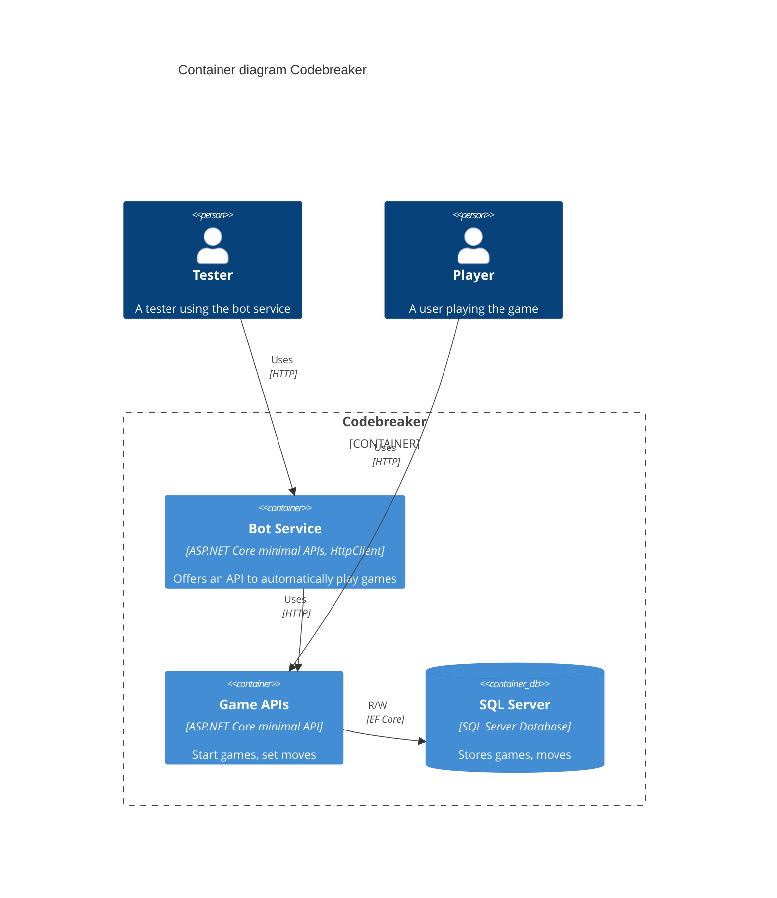

# Diagrams

## Docker Containers

```mermaid
C4Container
    title Container diagram Codebreaker

    Person(tester, "Tester" "A tester using the bot service")
    Person(player, "Player", "A user playing the game")

    Container_Boundary(c1, "Codebreaker") {
        Container(codebreaker.bot, "Bot Service", "ASP.NET Core minimal APIs, HttpClient", "Offers an API to automatically play games")
        Container(codebreaker.gameapis, "Game APIs", "ASP.NET Core minimal API", "Start games, set moves")
        ContainerDb(codebreaker.sql, "SQL Server", "SQL Server Database", "Stores games, moves")
    }

    Rel(tester, codebreaker.bot, "Uses", "HTTP")
    UpdateRelStyle(tester, codebreaker.bot, $offsetX="4" $offsetY="-60")
    Rel(player, codebreaker.gameapis, "Uses", "HTTP")
    UpdateRelStyle(player, codebreaker.gameapis, $offsetY="-60")

    Rel(codebreaker.bot, codebreaker.gameapis, "Uses", "HTTP")
    UpdateRelStyle(codebreaker.bot, codebreaker.gameapis, $offsetX="-20" $offsetY="-40")

    Rel(codebreaker.gameapis, codebreaker.sql, "R/W", "EF Core")
    UpdateRelStyle(codebreaker.gameapis, codebreaker.sql, $offsetX="-20" $offsetY="-40")
```