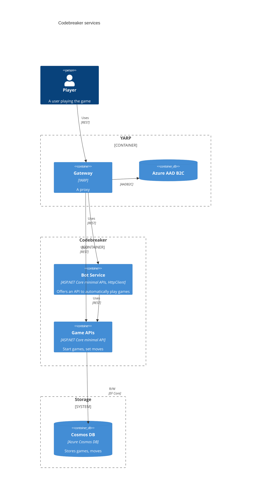

# Diagrams

## Codebreaker

```mermaid
C4Context
    title Codebreaker services

    Person(player, "Player", "A user playing the game")

    Container_Boundary(c1, "YARP") {
        Container(codebreaker.gateway, "Gateway", "YARP", "A proxy")
        ContainerDb(aadb2c, "Azure AAD B2C")
    }

    Container_Boundary(c2, "Codebreaker") {
        Container(codebreaker.bot, "Bot Service", "ASP.NET Core minimal APIs, HttpClient", "Offers an API to automatically play games")
        Container(codebreaker.gameapis, "Game APIs", "ASP.NET Core minimal API", "Start games, set moves")
    }

    System_Boundary(c3, "Storage") {
        ContainerDb(codebreaker.cosmos, "Cosmos DB", "Azure Cosmos DB", "Stores games, moves")
    }

    Rel(codebreaker.gateway, aadb2c, "", "AADB2C")
    UpdateRelStyle(codebreaker.gateway, aadb2c, $offsetX="-20" $offsetY="0")

    Rel(player, codebreaker.gateway, "Uses", "REST")
    UpdateRelStyle(player, codebreaker.gateway, $offsetY="-60")

    Rel(codebreaker.gateway, codebreaker.gameapis, "Uses", "REST")
    UpdateRelStyle(codebreaker.gateway, codebreaker.gameapis, $offsetX="-20" $offsetY="-40")

    Rel(codebreaker.gateway, codebreaker.bot, "Uses", "REST")
    UpdateRelStyle(codebreaker.gateway, codebreaker.bot, $offsetX="-20" $offsetY="-40")

    Rel(codebreaker.bot, codebreaker.gameapis, "Uses", "REST")
    UpdateRelStyle(codebreaker.bot, codebreaker.gameapis, $offsetX="-20" $offsetY="-40")

    Rel(codebreaker.gameapis, codebreaker.cosmos, "R/W", "EF Core")
    UpdateRelStyle(codebreaker.gameapis, codebreaker.cosmos, $offsetX="80" $offsetY="0")

    UpdateLayoutConfig($c4ShapeInRow="2", $c4BoundaryInRow="1")
```
