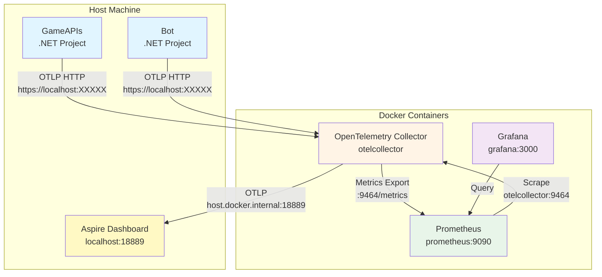
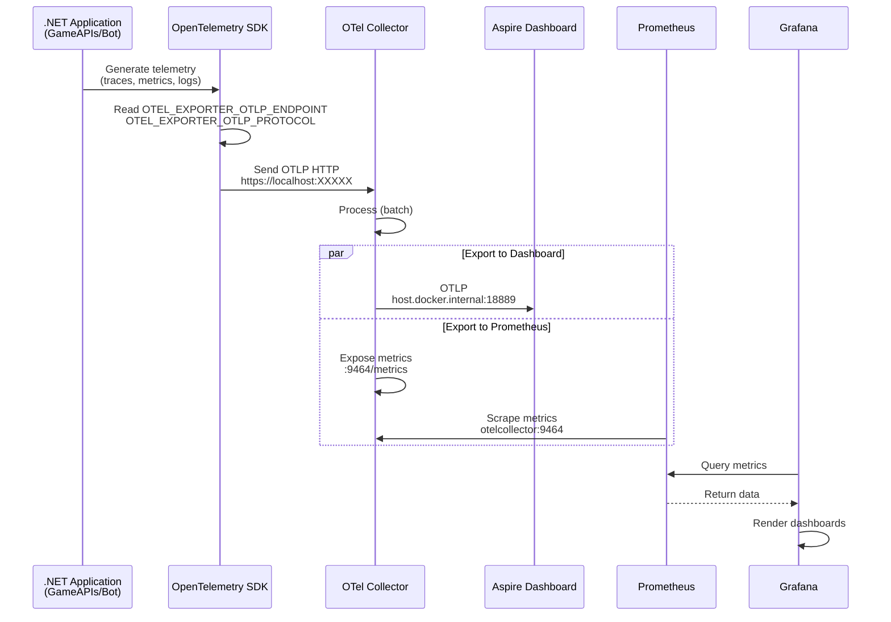
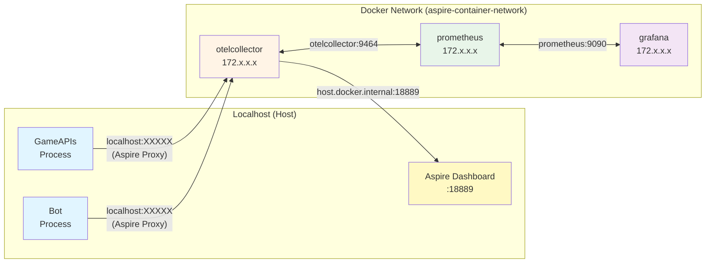
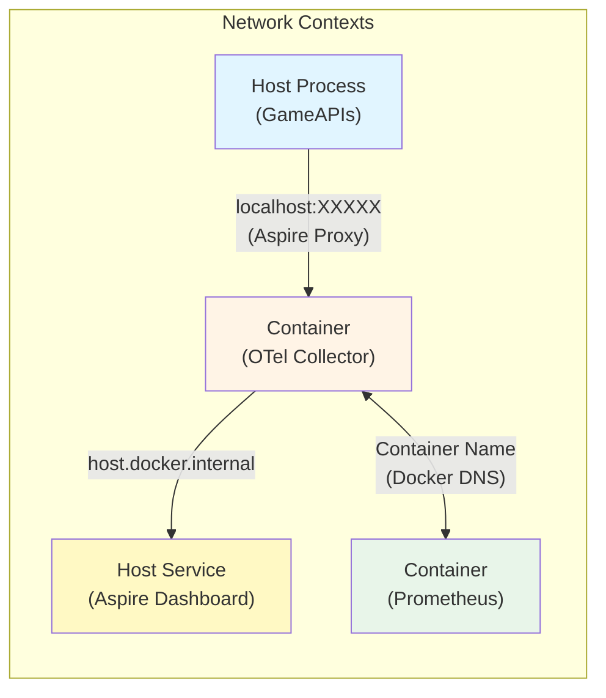

# OpenTelemetry Collector, Grafana, and Prometheus Setup Guide

## Table of Contents
- [Overview](#overview)
- [Architecture](#architecture)
- [Components](#components)
- [Configuration](#configuration)
- [Telemetry Flow](#telemetry-flow)
- [Troubleshooting](#troubleshooting)
- [Verification Steps](#verification-steps)
- [Key Learnings](#key-learnings)

## Overview

This guide documents the complete setup of an observability stack using OpenTelemetry Collector, Prometheus, and Grafana integrated with .NET Aspire applications.

### Technology Stack
- **.NET Aspire** - Application orchestration and telemetry
- **OpenTelemetry Collector** - Telemetry data pipeline
- **Prometheus** - Metrics storage and querying
- **Grafana** - Visualization and dashboarding
- **Aspire Dashboard** - Development-time observability

## Architecture



## Components

### 1. OpenTelemetry Collector

**Purpose**: Receives, processes, and exports telemetry data from applications.

**Container Configuration**:
```csharp
var otelCollector = builder.AddOpenTelemetryCollector("otelcollector")
    .WithConfig("../otelcollector/config.yaml")
    .WithEndpoint(targetPort: 9464, name: "prometheus")
    .WithEnvironment("ASPIRE_ENDPOINT", collectorDashboardUrl)
    .WithEnvironment("ASPIRE_API_KEY", dashboardOtlpApiKey ?? string.Empty)
    .WithEnvironment("ASPIRE_INSECURE", isHttpsEnabled ? "false" : "true");
```

**Exposed Ports**:
- `4317` - OTLP gRPC receiver (automatic)
- `4318` - OTLP HTTP receiver (automatic)
- `9464` - Prometheus metrics exporter (custom)
- `13233` - Health check endpoint

**Configuration File** (`otelcollector/config.yaml`):
```yaml
receivers:
  otlp:
    protocols:
      grpc:
        endpoint: 0.0.0.0:4317
      http:
        endpoint: 0.0.0.0:4318

processors:
  batch:
    timeout: 1s
    send_batch_size: 1024

exporters:
  otlp:
    endpoint: ${env:ASPIRE_ENDPOINT}
    tls:
      insecure: ${env:ASPIRE_INSECURE}
    headers:
      x-otlp-api-key: ${env:ASPIRE_API_KEY}

  prometheus:
    endpoint: "0.0.0.0:9464"
    namespace: codebreaker
    const_labels:
      environment: development

extensions:
  health_check:
    endpoint: 0.0.0.0:13233
    path: /

service:
  extensions: [health_check]
  pipelines:
    traces:
      receivers: [otlp]
      processors: [batch]
      exporters: [otlp]
    metrics:
      receivers: [otlp]
      processors: [batch]
      exporters: [otlp, prometheus]
    logs:
      receivers: [otlp]
      processors: [batch]
      exporters: [otlp]
```

### 2. Prometheus

**Purpose**: Scrapes and stores metrics from the OpenTelemetry Collector.

**Container Configuration**:
```csharp
var prometheus = builder.AddContainer("prometheus", "prom/prometheus")
    .WithBindMount("../prometheus", "/etc/prometheus", isReadOnly: true)
    .WithArgs("--web.enable-otlp-receiver", "--config.file=/etc/prometheus/prometheus.yml")
    .WithHttpEndpoint(targetPort: 9090, name: "http");
```

**Configuration File** (`prometheus/prometheus.yml`):
```yaml
global:
  scrape_interval: 1s

scrape_configs:
  - job_name: otelcollector
    static_configs:
      - targets: ['otelcollector:9464']
```

**Key Settings**:
- **Scrape Interval**: 1 second (fast refresh for development)
- **Target**: `otelcollector:9464/metrics`
- **Web UI**: `http://localhost:9090`

### 3. Grafana

**Purpose**: Visualizes metrics from Prometheus with dashboards.

**Container Configuration**:
```csharp
var grafana = builder.AddContainer("grafana", "grafana/grafana")
    .WithBindMount("../grafana/config", "/etc/grafana", isReadOnly: true)
    .WithBindMount("../grafana/dashboards", "/var/lib/grafana/dashboards", isReadOnly: true)
    .WithHttpEndpoint(targetPort: 3000, name: "http")
    .WithEnvironment("PROMETHEUS_ENDPOINT", prometheus.GetEndpoint("http"));
```

**Configuration File** (`grafana/config/grafana.ini`):
```ini
[auth.anonymous]
enabled = true
org_name = Main Org.
org_role = Admin
hide_version = false

[dashboards]
default_home_dashboard_path = /var/lib/grafana/dashboards/aspnetcore.json
min_refresh_interval = 1s
```

**Datasource Configuration** (`grafana/config/provisioning/datasources/default.yaml`):
```yaml
apiVersion: 1

datasources:
  - name: Prometheus
    type: prometheus
    access: proxy
    url: $PROMETHEUS_ENDPOINT
    uid: PBFA97CFB590B2093
```

**Dashboard Provisioning** (`grafana/config/provisioning/dashboards/default.yaml`):
```yaml
apiVersion: 1

providers:
  - name: Default
    folder: .NET
    type: file
    options:
      path: /var/lib/grafana/dashboards
```

### 4. Service Configuration (GameAPIs & Bot)

**Purpose**: Configure .NET projects to send telemetry to OpenTelemetry Collector.

**AppHost Configuration**:
```csharp
gameApis.WithEnvironment(async context =>
{
    // Projects run on host, use localhost with the proxied port
    var collectorEndpoint = await otelCollector.GetEndpoint("http")
        .GetValueAsync(context.CancellationToken);
    
    context.EnvironmentVariables["OTEL_EXPORTER_OTLP_ENDPOINT"] = collectorEndpoint!;
    context.EnvironmentVariables["OTEL_EXPORTER_OTLP_PROTOCOL"] = "http/protobuf";
})
.WaitFor(grafana)
.WaitFor(otelCollector);
```

**ServiceDefaults Configuration** (`Codebreaker.ServiceDefaults/Extensions.cs`):
```csharp
public static TBuilder ConfigureOpenTelemetry<TBuilder>(this TBuilder builder) 
    where TBuilder : IHostApplicationBuilder
{
    builder.Services.AddOpenTelemetry()
        .WithMetrics(metrics =>
        {
            metrics
                .AddMeter("EntityFramework.Core")
                .AddMeter("Microsoft.AspNetCore.Hosting")
                .AddMeter("Microsoft.AspNetCore.Server.Kestrel")
                .AddMeter("System.Net.Http")
                .AddMeter("System.Net.NameResolution")
                .AddAspNetCoreInstrumentation()
                .AddHttpClientInstrumentation()
                .AddRuntimeInstrumentation();
        })
        .WithTracing(tracing =>
        {
            tracing.AddSource(builder.Environment.ApplicationName)
                .AddAspNetCoreInstrumentation()
                .AddHttpClientInstrumentation();
        });

    builder.AddOpenTelemetryExporters();
    return builder;
}

private static TBuilder AddOpenTelemetryExporters<TBuilder>(this TBuilder builder) 
    where TBuilder : IHostApplicationBuilder
{
    // Always add OTLP exporter - reads OTEL_EXPORTER_OTLP_ENDPOINT at runtime
    builder.Services.AddOpenTelemetry().UseOtlpExporter();

    // Azure Monitor integration (optional)
    if (!string.IsNullOrEmpty(builder.Configuration["APPLICATIONINSIGHTS_CONNECTION_STRING"]))
    {
        builder.Services.AddOpenTelemetry().UseAzureMonitor();
    }

    return builder;
}
```

## Telemetry Flow



## Configuration

### Environment Variables

**Services (GameAPIs & Bot)**:
| Variable | Value | Purpose |
|----------|-------|---------|
| `OTEL_EXPORTER_OTLP_ENDPOINT` | `https://localhost:XXXXX` | Collector endpoint (proxied) |
| `OTEL_EXPORTER_OTLP_PROTOCOL` | `http/protobuf` | Force HTTP protocol (not gRPC) |
| `OTEL_SERVICE_NAME` | `gameapis` / `bot` | Service identifier |

**OpenTelemetry Collector**:
| Variable | Value | Purpose |
|----------|-------|---------|
| `ASPIRE_ENDPOINT` | `http://host.docker.internal:18889` | Aspire Dashboard OTLP endpoint |
| `ASPIRE_API_KEY` | `<api-key>` | Dashboard authentication |
| `ASPIRE_INSECURE` | `true` / `false` | TLS configuration |

### Network Architecture



**Key Points**:
1. **Host Processes ? Containers**: Use Aspire-provided localhost proxy URLs
2. **Container ? Host**: Use `host.docker.internal`
3. **Container ? Container**: Use container names (Docker DNS)

## Troubleshooting

### Issue 1: No Metrics in Aspire Dashboard or Prometheus

**Symptoms**:
- Console logs visible but no traces/metrics
- Prometheus returns "Empty query result"
- OTel Collector logs show no incoming data

**Diagnosis**:
```csharp
// Add to Program.cs for debugging
Console.WriteLine($"OTEL_EXPORTER_OTLP_ENDPOINT: {Environment.GetEnvironmentVariable("OTEL_EXPORTER_OTLP_ENDPOINT")}");
Console.WriteLine($"OTEL_EXPORTER_OTLP_PROTOCOL: {Environment.GetEnvironmentVariable("OTEL_EXPORTER_OTLP_PROTOCOL")}");

try {
    var addresses = System.Net.Dns.GetHostAddresses("otelcollector");
    Console.WriteLine($"DNS Resolution: {string.Join(", ", addresses)}");
}
catch (Exception ex) {
    Console.WriteLine($"DNS FAILED: {ex.Message}");
}
```

**Common Causes & Solutions**:

| Cause | Solution |
|-------|----------|
| ? Environment variable not set | Use `WithEnvironment` callback (not string value) |
| ? Wrong protocol (gRPC vs HTTP) | Set `OTEL_EXPORTER_OTLP_PROTOCOL=http/protobuf` |
| ? DNS resolution fails | Use `GetEndpoint("http")` for localhost proxy |
| ? OTLP exporter not enabled | Always call `UseOtlpExporter()` in ServiceDefaults |
| ? No traffic generated | Make API calls to generate telemetry |

**Fix Example**:
```csharp
// ? WRONG - Host process can't resolve container name
context.EnvironmentVariables["OTEL_EXPORTER_OTLP_ENDPOINT"] = "http://otelcollector:4318";

// ? CORRECT - Use Aspire proxy URL
var endpoint = await otelCollector.GetEndpoint("http").GetValueAsync(ct);
context.EnvironmentVariables["OTEL_EXPORTER_OTLP_ENDPOINT"] = endpoint!;
context.EnvironmentVariables["OTEL_EXPORTER_OTLP_PROTOCOL"] = "http/protobuf";
```

### Issue 2: OTel Collector Can't Reach Aspire Dashboard

**Symptoms**:
```
grpc: addrConn.createTransport failed to connect to {Addr: "localhost:16263"}
connection refused
```

**Cause**: Collector container using `localhost` to reach dashboard on host.

**Solution**:
```csharp
// ? WRONG
.WithEnvironment("ASPIRE_ENDPOINT", "http://localhost:18889")

// ? CORRECT
var dashboardUrl = builder.Configuration["ASPIRE_DASHBOARD_OTLP_ENDPOINT_URL"];
var collectorDashboardUrl = dashboardUrl.Replace("localhost", "host.docker.internal");
.WithEnvironment("ASPIRE_ENDPOINT", collectorDashboardUrl)
```

### Issue 3: Grafana Authentication Errors

**Symptoms**:
```
Failed to find organization" name="Codebreaker Org."
[org.notFound] failed to get org by name
```

**Cause**: Organization doesn't exist.

**Solution**:
```ini
# grafana/config/grafana.ini
[auth.anonymous]
enabled = true
org_name = Main Org.  # Use default organization
org_role = Admin
```

### Issue 4: Prometheus Not Scraping Collector

**Symptoms**:
- Prometheus shows target as "DOWN"
- No metrics in Prometheus UI

**Diagnosis**:
1. Check Prometheus targets: `http://localhost:9090/targets`
2. Verify collector metrics endpoint: `http://localhost:XXXXX/metrics` (find port in Aspire Dashboard)

**Solutions**:

| Problem | Fix |
|---------|-----|
| Target shows DOWN | Check network connectivity between containers |
| Wrong target URL | Verify `prometheus.yml` has correct target |
| Port not exposed | Add `.WithEndpoint(targetPort: 9464, name: "prometheus")` |

**prometheus.yml**:
```yaml
scrape_configs:
  - job_name: otelcollector
    static_configs:
      - targets: ['otelcollector:9464']  # Container name, not localhost
```

### Issue 5: Environment Variable Timing Issues

**Symptoms**:
- Environment variable set in logs but OTLP exporter not working
- Conditional `UseOtlpExporter()` not called

**Cause**: Environment callbacks execute after `builder.Services.AddOpenTelemetry()`.

**Solution**:
```csharp
// ? WRONG - Checks too early
bool useOtlp = !string.IsNullOrWhiteSpace(builder.Configuration["OTEL_EXPORTER_OTLP_ENDPOINT"]);
if (useOtlp) {
    builder.Services.AddOpenTelemetry().UseOtlpExporter();
}

// ? CORRECT - Always enable, reads env var at runtime
builder.Services.AddOpenTelemetry().UseOtlpExporter();
```

### Issue 6: Grafana Can't Connect to Prometheus

**Symptoms**:
- Grafana datasource shows "Error"
- No data in dashboards

**Solution**:
```csharp
// Ensure Prometheus endpoint is passed correctly
var grafana = builder.AddContainer("grafana", "grafana/grafana")
    .WithEnvironment("PROMETHEUS_ENDPOINT", prometheus.GetEndpoint("http"));
```

**Datasource config** (`grafana/config/provisioning/datasources/default.yaml`):
```yaml
apiVersion: 1

datasources:
  - name: Prometheus
    type: prometheus
    access: proxy
    url: $PROMETHEUS_ENDPOINT  # Uses environment variable
    uid: PBFA97CFB590B2093
```

## Verification Steps

### 1. Check OTel Collector Logs

```bash
docker logs $(docker ps --filter "name=otelcollector" --format "{{.ID}}") --tail 50
```

**Expected Output** (after generating traffic):
```
info    otlpreceiver    Traces request received    {"#spans": 5}
info    otlpreceiver    Metrics request received   {"#metrics": 20}
info    otlpreceiver    Logs request received      {"#logs": 10}
```

### 2. Verify Service Configuration

Check Aspire Dashboard ? Resource ? Environment Variables:

```
? OTEL_EXPORTER_OTLP_ENDPOINT = https://localhost:XXXXX
? OTEL_EXPORTER_OTLP_PROTOCOL = http/protobuf
? OTEL_SERVICE_NAME = gameapis
```

### 3. Test Prometheus

**Navigate to**: `http://localhost:9090`

**Query**:
```promql
http_server_request_duration_seconds_count
```

**Expected**: Multiple time series with labels (service_name, http_route, http_response_status_code)

### 4. Test Grafana

**Navigate to**: `http://localhost:3000`

**Steps**:
1. Go to **Explore**
2. Select **Prometheus** datasource
3. Enter query: `rate(http_server_request_duration_seconds_count[1m])`
4. Click **Run query**

**Expected**: Graph showing request rate over time

### 5. Verify Aspire Dashboard

**Navigate to**: `https://localhost:15101` (check AppHost logs for URL)

**Check**:
- **Structured Logging**: ? Logs visible
- **Traces**: ? HTTP request traces, distributed tracing
- **Metrics**: ? Charts showing runtime, HTTP, and custom metrics

## Key Learnings

### 1. Network Topology Understanding



**Key Rules**:
1. **Host ? Container**: Use Aspire localhost proxy (`https://localhost:XXXXX`)
2. **Container ? Host**: Use `host.docker.internal`
3. **Container ? Container**: Use container name (e.g., `otelcollector`)
4. **Never use**: Container names from host processes (DNS won't resolve)

### 2. OpenTelemetry Protocol Selection

**Default Behavior**:
- OpenTelemetry SDK defaults to **gRPC** protocol
- gRPC uses port **4317**
- HTTP uses port **4318**

**Solution**:
```csharp
// Force HTTP protocol
context.EnvironmentVariables["OTEL_EXPORTER_OTLP_PROTOCOL"] = "http/protobuf";
```

### 3. Environment Variable Timing

**Problem**: Aspire sets environment variables via callbacks that execute **after** service initialization.

**Impact**:
```csharp
// ? This check happens BEFORE callback sets the variable
bool useOtlp = !string.IsNullOrWhiteSpace(
    builder.Configuration["OTEL_EXPORTER_OTLP_ENDPOINT"]
);
```

**Solution**: Always enable OTLP exporter; it reads environment variables at runtime.

### 4. Aspire Automatic Endpoint Configuration

**Aspire automatically sets** `OTEL_EXPORTER_OTLP_ENDPOINT` for all project resources to point to the dashboard.

**To override**:
- Must use **environment callback** (not direct `WithEnvironment(name, value)`)
- Callback executes later and can override automatic configuration

### 5. Container Endpoint Exposure

**CommunityToolkit.Aspire.Hosting.OpenTelemetryCollector** automatically creates:
- `grpc` endpoint (port 4317)
- `http` endpoint (port 4318)

**Custom endpoints** must be explicitly added:
```csharp
.WithEndpoint(targetPort: 9464, name: "prometheus")
```

### 6. Prometheus Scraping

**Scrape config** must use:
- **Container name** (not localhost): `otelcollector:9464`
- **Correct port**: Port where Prometheus exporter is exposed
- **Network accessibility**: Both must be on same Docker network

### 7. Grafana Anonymous Auth

**Default org** in Grafana is `Main Org.` (not configurable by name creation).

**Solution**: Use the default:
```ini
[auth.anonymous]
org_name = Main Org.
```

### 8. Telemetry Generation

**Important**: Telemetry is **only sent when there's activity**.

**No traffic** = No telemetry = Empty dashboards

**Solution**: Generate traffic by:
- Making HTTP requests to services
- Using Swagger UI
- Running integration tests

## Metrics Available

### ASP.NET Core Metrics

| Metric | Description |
|--------|-------------|
| `http_server_request_duration_seconds` | HTTP request duration histogram |
| `http_server_active_requests` | Current active HTTP requests |
| `kestrel_active_connections` | Active Kestrel connections |
| `kestrel_connection_duration_seconds` | Connection duration |

### .NET Runtime Metrics

| Metric | Description |
|--------|-------------|
| `process_runtime_dotnet_gc_collections_count` | GC collection count |
| `process_runtime_dotnet_gc_heap_size_bytes` | GC heap size |
| `process_runtime_dotnet_thread_pool_thread_count` | Thread pool threads |
| `process_runtime_dotnet_assemblies_count` | Loaded assemblies |

### HTTP Client Metrics

| Metric | Description |
|--------|-------------|
| `http_client_request_duration_seconds` | Outbound HTTP request duration |
| `http_client_active_requests` | Active outbound requests |

### System.Net Metrics

| Metric | Description |
|--------|-------------|
| `dns_lookup_duration_seconds` | DNS lookup duration |

## Example Queries

### Prometheus Queries

**Request Rate**:
```promql
rate(http_server_request_duration_seconds_count[1m])
```

**Average Response Time**:
```promql
rate(http_server_request_duration_seconds_sum[1m]) 
/ 
rate(http_server_request_duration_seconds_count[1m])
```

**Requests by Status Code**:
```promql
http_server_request_duration_seconds_count{http_response_status_code="200"}
```

**GC Collection Rate**:
```promql
rate(process_runtime_dotnet_gc_collections_count[1m])
```

**Active Connections**:
```promql
kestrel_active_connections
```

## References

- [OpenTelemetry Collector Documentation](https://opentelemetry.io/docs/collector/)
- [Prometheus Documentation](https://prometheus.io/docs/)
- [Grafana Documentation](https://grafana.com/docs/)
- [.NET Aspire Telemetry](https://learn.microsoft.com/en-us/dotnet/aspire/fundamentals/telemetry)
- [OpenTelemetry .NET](https://opentelemetry.io/docs/languages/net/)
- [CommunityToolkit.Aspire.Hosting.OpenTelemetryCollector](https://github.com/CommunityToolkit/Aspire)

## Summary

This setup provides a complete observability stack for .NET Aspire applications:

? **Metrics** collected from ASP.NET Core, runtime, and HTTP clients  
? **Traces** for distributed tracing across services  
? **Logs** with structured logging support  
? **Multiple destinations**: Aspire Dashboard (dev) + Prometheus/Grafana (production-like)  
? **Flexible architecture**: Easy to swap components or add new destinations  

The key challenge was understanding the **network topology** between host processes and containers, and configuring **environment variables at the right time** to override Aspire's defaults.
