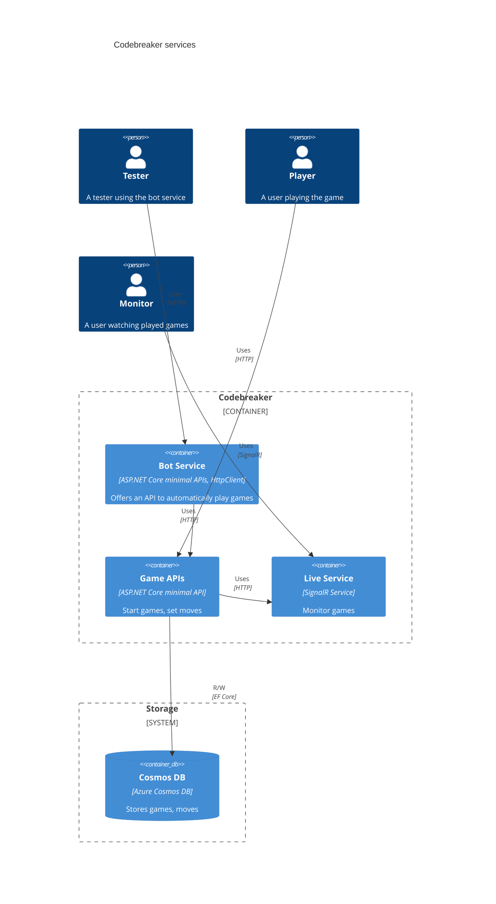

# Diagrams

## Codebreaker

```mermaid
C4Context
    title Codebreaker services

    Person(tester, "Tester" "A tester using the bot service")
    Person(player, "Player", "A user playing the game")
    Person(monitor, "Monitor", "A user watching played games")

    Container_Boundary(c1, "Codebreaker") {
        Container(codebreaker.bot, "Bot Service", "ASP.NET Core minimal APIs, HttpClient", "Offers an API to automatically play games")
        Container(codebreaker.gameapis, "Game APIs", "ASP.NET Core minimal API", "Start games, set moves")
        Container(codebreaker.live, "Live Service", "SignalR Service", "Monitor games")
    }

    System_Boundary(c2, "Storage") {
        ContainerDb(codebreaker.cosmos, "Cosmos DB", "Azure Cosmos DB", "Stores games, moves")
    }

    Rel(tester, codebreaker.bot, "Uses", "HTTP")
    UpdateRelStyle(tester, codebreaker.bot, $offsetX="4" $offsetY="-60")

    Rel(player, codebreaker.gameapis, "Uses", "HTTP")
    UpdateRelStyle(player, codebreaker.gameapis, $offsetY="-60")

    Rel(monitor, codebreaker.live, "Uses", "SignalR")
    UpdateRelStyle(monitor, codebreaker.live, $offxsetY="-90")

    Rel(codebreaker.bot, codebreaker.gameapis, "Uses", "HTTP")
    UpdateRelStyle(codebreaker.bot, codebreaker.gameapis, $offsetX="-20" $offsetY="-40")

    Rel(codebreaker.gameapis, codebreaker.live, "Uses", "HTTP")
    UpdateRelStyle(codebreaker.gameapis, codebreaker.live, $offsetX="-20" $offsetY="-40")

    Rel(codebreaker.gameapis, codebreaker.cosmos, "R/W", "EF Core")
    UpdateRelStyle(codebreaker.gameapis, codebreaker.cosmos, $offsetX="80" $offsetY="0")

      UpdateLayoutConfig($c4ShapeInRow="3", $c4BoundaryInRow="1")
```
