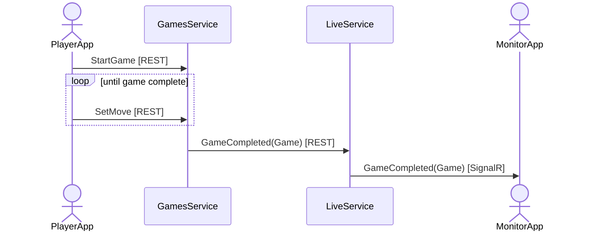

# Diagrams

## Codebreaker

```mermaid
sequenceDiagram
    actor PlayerApp
    participant GamesService
    participant LiveService
    actor MonitorApp
    PlayerApp->>GamesService: StartGame [REST]
    loop until game complete 
      PlayerApp->>GamesService: SetMove [REST]
    end
    GamesService->>LiveService: GameCompleted(Game) [REST]
    LiveService->>MonitorApp: GameCompleted(Game) [SignalR]
```
