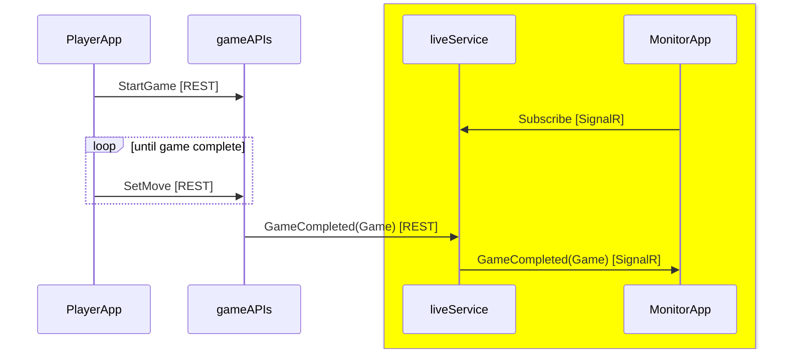
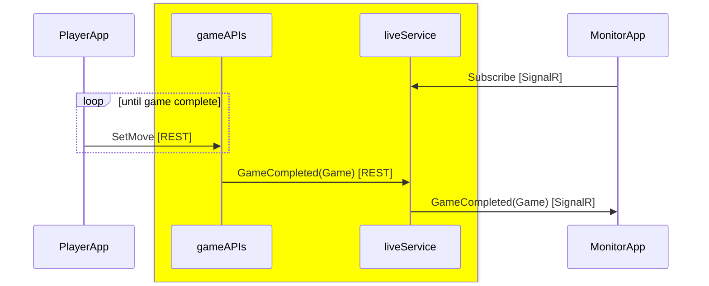
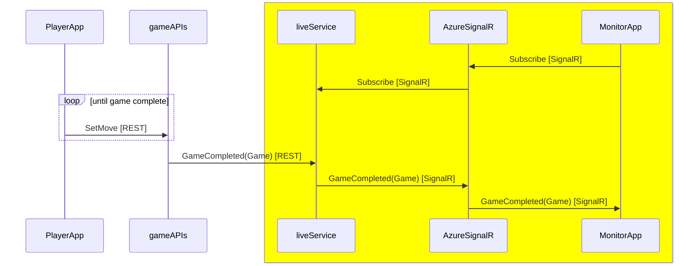

# Diagrams

## Codebreaker with SignalR

```mermaid
sequenceDiagram
    participant PlayerApp
    participant gameAPIs
    box yellow
      participant liveService
      participant MonitorApp
    end
    PlayerApp->>gameAPIs: StartGame [REST]
    MonitorApp->>liveService: Subscribe [SignalR]
    loop until game complete 
      PlayerApp->>gameAPIs: SetMove [REST]
    end
    gameAPIs->>liveService: GameCompleted(Game) [REST]
    liveService->>MonitorApp: GameCompleted(Game) [SignalR]
```

## Interaction game APIs --> live Service

```mermaid
sequenceDiagram
    participant PlayerApp
    box yellow
      participant gameAPIs
      participant liveService
    end
    participant MonitorApp
    MonitorApp->>liveService: Subscribe [SignalR]
    loop until game complete 
      PlayerApp->>gameAPIs: SetMove [REST]
    end
    gameAPIs->>liveService: GameCompleted(Game) [REST]
    liveService->>MonitorApp: GameCompleted(Game) [SignalR]
```

## SignalR Service

```mermaid
sequenceDiagram
    participant PlayerApp
    participant gameAPIs
    box yellow
      participant liveService
      participant AzureSignalR
      participant MonitorApp
    end
    MonitorApp->>AzureSignalR: Subscribe [SignalR]
    AzureSignalR->>liveService: Subscribe [SignalR]
    loop until game complete 
      PlayerApp->>gameAPIs: SetMove [REST]
    end
    gameAPIs->>liveService: GameCompleted(Game) [REST]
    liveService->>AzureSignalR: GameCompleted(Game) [SignalR]
    AzureSignalR->>MonitorApp: GameCompleted(Game) [SignalR]
```