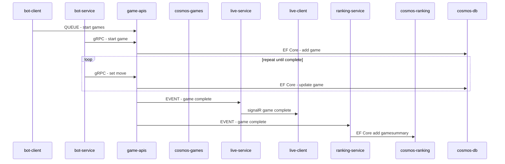

```mermaid
sequenceDiagram
  participant bot-client
  participant bot-service
  participant game-apis
  participant cosmos-games
  participant live-service
  participant live-client
  participant ranking-service
  participant cosmos-ranking

  bot-client->>game-apis: QUEUE - start games
  bot-service->>game-apis: gRPC - start game
  game-apis->>cosmos-db: EF Core - add game
  loop repeat until complete
    bot-service->>game-apis: gRPC - set move
    game-apis->>cosmos-db: EF Core - update game
  end
  game-apis->>live-service: EVENT - game complete
  live-service->>live-client: signalR game complete
  game-apis->>ranking-service: EVENT - game complete
  ranking-service->>cosmos-ranking: EF Core add gamesummary
```
