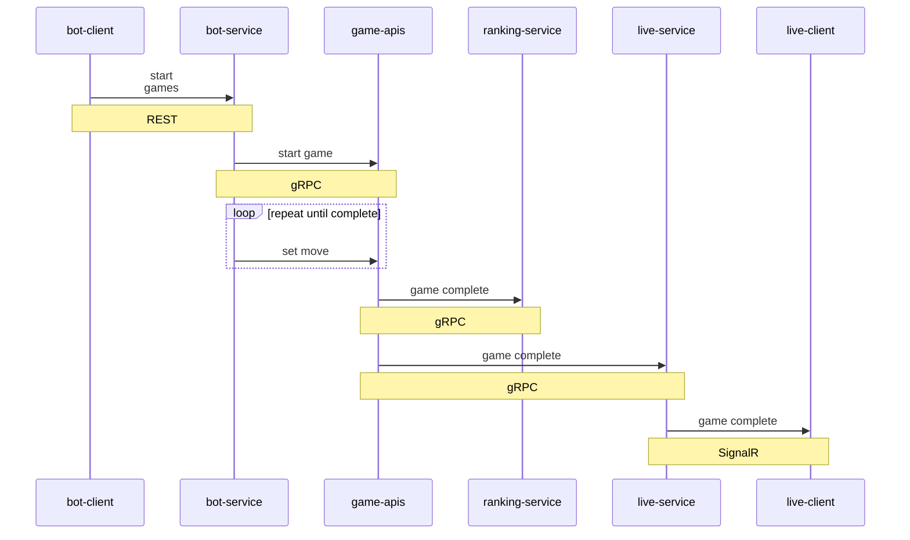
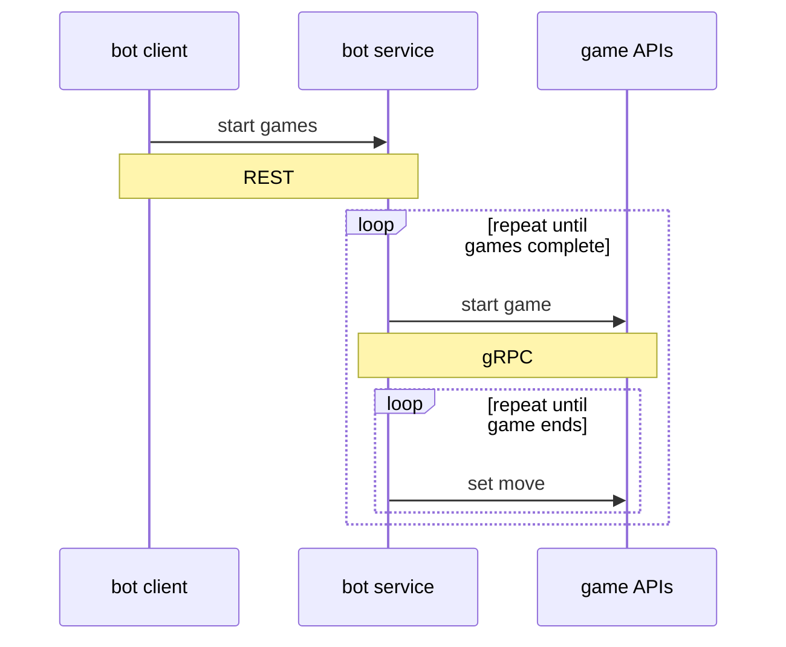
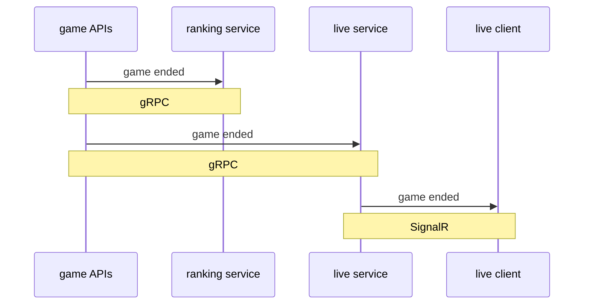

# Sequence Diagrams - Synchronous Communication

```mermaid
%%{
  init: {
      "sequence": {
        "actorFontWeight": "bold",
        "actorFontSize": "24",
        "font-size": "44px"
        "noteFontSize": "24"
        ".labelText" {
          "font-size": "44px"
  
        }
      }
  }
}%%

sequenceDiagram
  participant bot-client
  participant bot-service
  participant game-apis
  participant ranking-service
  participant live-service
  participant live-client

  bot-client->>bot-service: start<br> games
  Note over bot-client,bot-service: REST

  bot-service->>game-apis: start game
  Note over bot-service,game-apis: gRPC 

  loop repeat until complete
    bot-service->>game-apis: set move
  end
  game-apis->>ranking-service: game complete
  Note over game-apis,ranking-service: gRPC
  game-apis->>live-service: game complete
  Note over game-apis,live-service: gRPC
  live-service->>live-client: game complete
  Note over live-service,live-client: SignalR

```

## Part 1 Bot to game APIs

```mermaid
%%{
  init: {
      "sequence": {
        "actorFontWeight": "bold",
        "actorFontSize": "24",
        "font-size": "44px"
        "noteFontSize": "24"
        ".labelText" {
          "font-size": "44px"
  
        }
      }
  }
}%%

sequenceDiagram
  participant bot client
  participant bot service
  participant game APIs

  bot client->>bot service: start games
  Note over bot client,bot service: REST

  loop repeat until<br>games complete
    bot service->>game APIs: start game
    Note over bot service,game APIs: gRPC 

    loop repeat until<br>game ends
      bot service->>game APIs: set move
    end
  end

```

## Part 2 game APIs to live and ranking services

```mermaid
%%{
  init: {
      "sequence": {
        "actorFontWeight": "bold"
        "noteFontWeight": "bold"
      }
  }
}%%

sequenceDiagram
  participant game APIs
  participant ranking service
  participant live service
  participant live client

  game APIs->>ranking service: game ended
  Note over game APIs,ranking service: gRPC
  game APIs->>live service: game ended
  Note over game APIs,live service: gRPC
  live service->>live client: game ended
  Note over live service,live client: SignalR

```